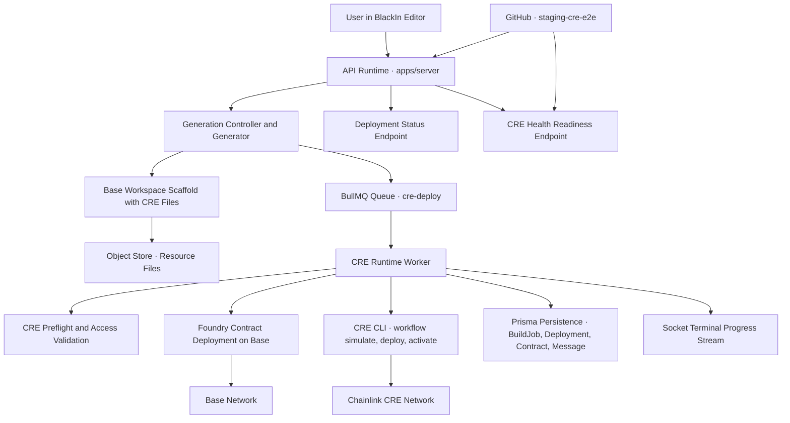

# BlackIn — Chainlink CRE Integration
## Technical Research & Architecture Documentation

---

| Field | Detail |
|---|---|
| **Document Type** | Technical Research Documentation |
| **Classification** | Confidential — Internal Distribution |
| **Subject System** | BlackIn AI-Powered Code Editor |
| **Integration Scope** | Chainlink CRE with Base Network (Foundry + CRE CLI) |
| **Primary Reference** | `apps/server/src/chains/base/cre_adapter.ts` |
| **Standard Alignment** | Chainlink CRE TypeScript & CLI Specification (`llms-full-ts.txt`) |

---

## 1. Executive Summary

This document constitutes the official technical research record for the integration of Chainlink Compute and Runtime Environment (CRE) within BlackIn, an AI-powered code editor developed for Base-native smart contract workflows. The purpose of this reference is to provide a comprehensive, authoritative account of system architecture, application flow, module responsibilities, and standards alignment, suitable for internal engineering review, onboarding, and compliance assessment.

BlackIn operates as a full-stack platform in which an authenticated user composes a natural language or structured prompt that is processed by a generation engine to produce a deployable Base smart contract workspace. The platform does not stop at code generation; it continues through a fully automated deployment pipeline that provisions Foundry-based contract deployments on the Base network and executes Chainlink CRE workflow lifecycle commands, resulting in a live, activated workflow registered on the Chainlink CRE network.

The integration described in this document aligns directly to the Chainlink CRE TypeScript SDK and CLI specification published at the official Chainlink documentation endpoint. All workflow artifact generation, simulation, deployment, and activation steps follow the prescribed command structure and project model defined in that specification.

---

## 2. System Overview and Architectural Composition

BlackIn is composed of three primary runtime boundaries: an API and orchestration server, a WebSocket command and terminal transport runtime, and a set of shared type and persistence packages. Each boundary has a well-defined responsibility, and together they form a continuous pipeline from user intent to onchain deployment outcome.

### 2.1 API and Orchestration Server

The server process, located in the `apps/server` application directory, serves as the authoritative entry point for all generation and deployment operations. Server initialization — including HTTP middleware configuration, CORS policy enforcement, route registration, and service bootstrap — is performed at startup, as defined in `apps/server/src/index.ts:6-53`. The API surface, wired in `apps/server/src/routes/index.ts:45-180`, exposes generation, health, and deployment status endpoints. Generation requests are received at the `POST /api/v1/generate` route at `apps/server/src/routes/index.ts:64-71`, which is the primary ingress for all AI-driven contract and workflow creation activity.

### 2.2 WebSocket Command and Terminal Runtime

The socket runtime, located in the `apps/socket` application directory, provides real-time command execution and terminal output streaming capabilities. It is initialized in `apps/socket/src/services/services.init.ts:15-24`, and handles WebSocket authorization and session binding for user and contract channels in `apps/socket/src/ws/socket.server.ts:124-170`. It facilitates the dispatch of deploy commands through the same underlying queue infrastructure used by the server, ensuring that socket-initiated deployments follow an identical execution path to API-initiated ones and maintaining operational parity across interaction surfaces.

### 2.3 Shared Packages

The packages layer provides shared type definitions, schema contracts, and persistence abstractions consumed by both the server and socket runtimes. Chain and command level targeting for Base is defined in `packages/types/src/build_types/build_types.ts:18-27` and `apps/server/src/schemas/command_schema.ts:9-18`. The Prisma-based persistence layer for build jobs, deployments, contracts, and messages resides here, enabling a unified data model across the system.

---

## 3. Application Flow

The complete BlackIn operational flow proceeds through five distinct phases: request intake and validation, AI-assisted generation, queue dispatch, CRE deploy orchestration, and result persistence and observability. Each phase is described below in terms of its purpose, responsible components, and interface with adjacent phases.

### 3.1 Request Intake and Validation

All generation activity originates from an authenticated POST request to the generation endpoint. The generation controller at `apps/server/src/controllers/gen/generate_contract_controller.ts:15-190` is responsible for resolving user context, validating the request schema, enforcing chain selection guards, and dispatching the generation execution process. The controller ensures that only requests conforming to the Base chain target and carrying valid credentials proceed to the generation engine. This boundary represents the first security and conformance gate in the pipeline.

### 3.2 AI-Assisted Generation and Workspace Construction

The generation engine creates a planning context during which CRE workflow intent is established. CRE workflow steps are composed at planning time in `apps/server/src/generator/generator.ts:190-196` and incorporated into the generation output. The generator then merges LLM-produced outputs with a Base monorepo scaffold at `apps/server/src/generator/generator.ts:310-314`, implemented through the `prepareBaseMonorepoTemplate` function in `apps/server/src/chains/base/template.ts:27-420`. This scaffold provides a complete Base-compatible workspace structure that includes CRE-compatible code and manifests from the outset, ensuring all generated workspaces are deployment-ready without requiring post-generation structural patching.

Following workspace finalization, the generated artifacts are uploaded to object storage at `apps/server/src/generator/generator.ts:398`. This upload serves as the durable handoff point between the stateless generation process and the stateful deployment pipeline. The generation service then enqueues a CRE deploy job at `apps/server/src/generator/generator.ts:400-409`, which constitutes the transition from AI generation to onchain and workflow execution.

### 3.3 Queue Dispatch and Worker Initialization

The CRE deploy job queue is implemented using BullMQ and defined in `apps/server/src/queue/cre_worker_queue.ts:9-30`, with startup wiring in `apps/server/src/services/init.ts:25-45`. Both the server and socket runtimes share this queue infrastructure — the socket queue initialization is in `apps/socket/src/services/services.init.ts:13-20`, and its queue payload structure and enqueue call are implemented in `apps/socket/src/queue/redis.socket.queue.ts:11-60`. This shared queue model ensures a single, well-tested execution path for all deployment operations regardless of origin.

### 3.4 CRE Deploy Orchestration

The CRE runtime worker at `apps/server/src/queue/cre_runtime_worker.ts:25-340` is the primary execution environment for all deployment activity. Upon receiving a job, the worker validates Base contract constraints at lines `70-93`, retrieves generated workspace files from object storage at lines `159-162`, and invokes `executeCreDeployWorkflow` at lines `171-184`. After contract deployment, the worker validates that deployed contract addresses are non-zero at lines `186-196`, confirming successful on-chain registration. Deployment outcomes, including metadata and transaction references, are persisted at lines `199-237`.

### 3.5 Result Persistence and Observability

Deployment outcomes are persisted using the Prisma-based data layer, recording build job status, deployment records, contract addresses, and associated messages. Observability is provided through dedicated API endpoints for deployment status retrieval and CRE health and readiness checks. The health endpoint supports both standard and strict readiness assessment, with strictness controlled by the `SERVER_CRE_STARTUP_PRECHECK_REQUIRED` configuration parameter, enabling environment-appropriate startup behavior.

---

## 4. Chainlink CRE Adapter — Core Integration Module

The primary Chainlink CRE runtime integration is consolidated within `apps/server/src/chains/base/cre_adapter.ts:1-1620`. This module is the authoritative implementation of the Chainlink CRE interface within BlackIn and encompasses all environment resolution, access verification, artifact generation, workflow execution, and output normalization concerns.

### 4.1 Environment and Configuration Resolution

At initialization, the adapter resolves all required environment parameters at lines `167-221`, including the CRE CLI binary path, CLI minimum version constraint, runner mode, API key, private key, Base mainnet and testnet RPC URLs, and Ethereum funding RPC URL. These values are drawn from the application configuration layer at `apps/server/src/configs/config.env.ts:14-125`, which is validated at runtime startup to ensure completeness and correctness before any deployment activity is permitted.

### 4.2 Access Verification and Preflight Validation

Prior to any deployment, the adapter executes a structured preflight validation sequence implemented in `runCreDeployPreflight` at lines `1079-1225`. This sequence verifies API key presence, private key presence, CRE CLI version compliance, Foundry toolchain availability, deploy access, linked owner key verification, and minimum funding balance. Deploy access verification follows the CRE CLI pattern using `cre whoami` with a fallback to `cre account access` at lines `249-287`. Linked owner key verification is performed via `cre account list-key` at lines `337-356`. Funding checks are executed through `cast balance` with a configurable minimum wei threshold at lines `358-381`.

The parser layer that interprets command output for these checks is implemented in `apps/server/src/chains/base/cre_deploy_access_parser.ts:6-37` and `apps/server/src/chains/base/cre_linked_keys_parser.ts:11-57`, each covered by unit tests in `cre_adapter.deploy_access.test.ts:18-43` and `cre_adapter.linked_keys.test.ts:21-65` respectively, which form part of the server test suite contract.

A startup preflight mode at lines `1227-1236`, called by `apps/server/src/services/init.ts:29-37`, allows operators to configure whether the service will refuse to start when CRE prerequisites are unmet. This behavior is distinct from the per-deployment preflight, which always runs immediately before job execution.

### 4.3 CRE Project Artifact Generation

The adapter generates and patches all CRE project artifacts in accordance with the Chainlink CRE project model at lines `920-981`. The artifacts produced include the project manifest (`project.yaml`), secrets manifest (`secrets.yaml`), workflow manifest (`workflow.yaml`), workflow runtime source files, and per-target configuration files. Project target manifests are rendered with Base chain selectors and an optional workflow owner address at lines `387-398`. Secret mappings are generated for CRE secrets model compliance at lines `400-405`. Workflow manifests are generated for both staging and production targets at lines `407-409`, and workflow configuration patching with chain selector updates is applied at lines `870-917`.

### 4.4 Workflow Runtime Source Generation

The generated workflow runtime source, rendered at lines `441-607`, aligns with the Chainlink CRE TypeScript SDK. The generated code incorporates `CronCapability` for scheduled triggers, `ConfidentialHTTPClient` and `HTTPClient` for external data access, `EVMClient` for on-chain interaction, and `Runner` for workflow execution management, together with runtime configuration for chain selector and workflow owner. This same structural pattern is reflected in the template-level workspace generation at `apps/server/src/chains/base/template.ts:233-406`, ensuring first-generation Base workspaces carry CRE-compatible code and manifests without requiring subsequent regeneration.

### 4.5 Dependency Management

The adapter supports two dependency resolution modes for CRE workflow execution: a prebuilt mode that links against pre-installed dependencies within the runtime container, and a dynamic mode that performs `npm install` at execution time as a fallback. Prebuilt dependency linking and dynamic fallback are implemented at lines `994-1046`, with runner mode derived from configuration at lines `175-185`. The runtime container defined in `apps/server/Dockerfile:5-50` is built with CRE CLI and Foundry pre-installed, and prebuilt CRE workflow dependencies are materialized during image construction, enabling fast and reproducible execution.

---

## 5. Deployment Pipeline

The deployment pipeline represents the operational core of the BlackIn platform, transforming generated workspace artifacts into deployed contracts and activated Chainlink CRE workflows. The pipeline is implemented within `executeCreDeployWorkflow` at `apps/server/src/chains/base/cre_adapter.ts:1350-1620`.

### 5.1 Workspace Materialization

Workspace files retrieved from object storage are materialized to the local filesystem within the execution environment at lines `665-672`. This step recreates the complete generated workspace structure, providing the Foundry toolchain and CRE CLI with the file-based inputs they require.

### 5.2 Contract Deployment via Foundry

Contract deployment is executed through Foundry script discovery and broadcast at lines `793-846`. The adapter identifies the relevant deployment script within the workspace, executes it against the Base network using the Foundry broadcast mechanism, and captures the resulting contract address. This step establishes the on-chain presence of the generated contract before workflow activation.

### 5.3 CRE Workflow Lifecycle Execution

Following contract deployment, the CRE workflow lifecycle is executed at lines `1443-1540` using the official command structure prescribed by the Chainlink CRE CLI specification. The three lifecycle stages — `workflow simulate`, `workflow deploy`, and `workflow activate` — are executed in sequence with target resolution applied at each stage. These commands correspond directly to the workflow lifecycle model described in the Chainlink CRE documentation, and their execution in sequence constitutes a complete and specification-compliant workflow registration.

### 5.4 Output Normalization and Payload Construction

After the lifecycle commands complete, the adapter normalizes output metadata and constructs the final deployment payload at lines `1562-1616`. This payload includes workflow identifiers, transaction references, and contract addresses, which are returned to the runtime worker for persistence and made available through the deployment status API endpoint.

### 5.5 Generation Simulation Path

A separate execution path exists for CRE planning and dry-run behavior. `executeCreGenerationWorkflow` at lines `1268-1348` executes CRE simulation against generated workflow artifacts and returns workflow plan metadata without performing actual on-chain deployment. This facility supports generation preview scenarios and is composed as part of `composeCreWorkflow` at lines `1238-1266`, which defines the high-level planning and reasoning stages used during generation.

---

## 6. Component Reference Summary

The following table summarises the principal modules, their primary source references, and their responsibilities within the BlackIn system.

| Module / Component | Primary Source Reference | Responsibility |
|---|---|---|
| Generation Controller | `apps/server/src/controllers/gen/generate_contract_controller.ts:15-190` | Request intake, schema validation, chain guard, dispatch |
| Generator Engine | `apps/server/src/generator/generator.ts:190-409` | CRE planning, LLM merge, scaffold composition, queue enqueue |
| Base Scaffold Template | `apps/server/src/chains/base/template.ts:27-420` | Base monorepo scaffold with CRE-compatible manifests and source |
| CRE Adapter | `apps/server/src/chains/base/cre_adapter.ts:1-1620` | Env resolution, preflight, artifact generation, deploy pipeline |
| CRE Deploy Worker | `apps/server/src/queue/cre_runtime_worker.ts:25-340` | Job consumption, constraint validation, storage retrieval, persistence |
| Worker Queue | `apps/server/src/queue/cre_worker_queue.ts:9-30` | BullMQ queue contract for `cre-deploy` jobs |
| Socket Command Service | `apps/socket/src/services/services.command.ts:21-135` | Command validation, CRE credential checks, queue dispatch |
| Deploy Access Parser | `apps/server/src/chains/base/cre_deploy_access_parser.ts:6-37` | Parse `cre whoami` / `cre account access` output |
| Linked Keys Parser | `apps/server/src/chains/base/cre_linked_keys_parser.ts:11-57` | Parse `cre account list-key`, verify owner |
| Deployment Status Controller | `apps/server/src/controllers/contract-controller/getDeploymentStatus.ts:16-82` | Retrieve and return deployment outcome records |
| CRE Health Controller | `apps/server/src/controllers/health-controller/getCreHealthController.ts:60-142` | CRE readiness and health check endpoint |
| E2E Smoke Executor | `apps/server/src/scripts/cre_e2e_smoke.ts:150-266` | CI smoke test: prompt to deployment validation |
| Staging CI Workflow | `.github/workflows/staging-cre-e2e.yml:1-81` | CI orchestration: SHA verify, smoke run, artifact upload |
| Config Validation | `apps/server/src/configs/config.env.ts:14-125` | Runtime environment validation |

---

## 7. Security, Observability, and Operational Standards

### 7.1 API Security

Browser-side API security is enforced through a CORS policy module at `apps/server/src/security/cors.ts:17-41`, integrated at server bootstrap in `apps/server/src/index.ts:25-30`. Authentication middleware at `apps/server/src/middlewares/middleware.auth.ts:22-72` validates session tokens for protected endpoints, and the admin secret middleware at `apps/server/src/middlewares/middleware.adminSecret.ts:22-41` provides additional protection for the health readiness endpoint. These controls ensure deployment and health endpoints are accessible only to authorized clients.

### 7.2 Observability Endpoints

Two dedicated observability endpoints are provided. The deployment status endpoint at `apps/server/src/routes/index.ts:163-168` allows callers to retrieve the current outcome of a specific deployment operation, including workflow identifiers, transaction data, and contract addresses. The CRE health endpoint at `apps/server/src/routes/index.ts:55-61` provides both standard and strict readiness signals, enabling load balancer integration and startup gate behavior appropriate to the deployment environment.

### 7.3 Configuration and Environment Standards

All configuration parameters are validated at server startup using the runtime configuration validation module. An example environment file at `.env.example:1-54` documents the full set of required and optional parameters. Chain and command level targeting is enforced through `apps/server/src/chains/request_guard.ts:11-34` and `apps/server/src/chains/registry.ts:14-42`, collectively ensuring that only valid and supported configurations reach the deployment pipeline.

---

## 8. Continuous Integration and Release Validation

The operational release flow for the Chainlink CRE integration is validated through a dedicated staging CI pipeline at `.github/workflows/staging-cre-e2e.yml:1-81`. This pipeline verifies the staging release commit hash through the CRE health endpoint, executes smoke generation and deploy checks against the staging environment, and uploads deployment artifacts for audit and traceability.

The smoke executor at `apps/server/src/scripts/cre_e2e_smoke.ts:150-266` validates the complete flow from prompt submission through generation, deployment, and workflow activation. It asserts the presence of a workflow identifier, transaction data, and a non-zero contract address in the deployment output. Successful completion of this pipeline constitutes the formal release gate for the CRE integration, providing confidence that the end-to-end system operates correctly in the target environment prior to production promotion.

---

## 9. Standards Alignment and Specification Conformance

The BlackIn CRE integration has been designed and implemented in direct alignment with the Chainlink CRE TypeScript and CLI specification. The workflow artifact structure — including project manifest, secrets manifest, workflow manifest, and runtime source — conforms to the project model described in the Chainlink CRE reference documentation. The workflow lifecycle commands are executed using the exact command structure and target resolution patterns prescribed by the specification.

The generated workflow runtime source makes use of official Chainlink CRE SDK constructs exclusively. No custom abstractions are introduced that would deviate from or obscure the SDK interface. This conformance ensures that generated workflows are maintainable by any engineer familiar with the Chainlink CRE TypeScript SDK and that they will behave predictably within the Chainlink CRE network.

The primary source of truth for CRE execution behavior within BlackIn is the CRE adapter module. All other components in the pipeline — including the queue, worker, socket services, and CI scripts — operate in support of the workflows defined within this module. Any future changes to the Chainlink CRE specification should be assessed against the adapter module in the first instance.

---

## 10. System Architecture Diagram

---

## 11. Conclusion

This document has presented a comprehensive technical research record of the BlackIn and Chainlink CRE integration. The system demonstrates a well-structured, specification-conformant approach to AI-assisted smart contract generation and automated workflow deployment on the Base and Chainlink CRE networks. The separation of concerns across generation, queue orchestration, CRE adapter execution, and observability components provides a maintainable and extensible architecture that can accommodate future evolution of both the BlackIn platform and the Chainlink CRE specification.

Engineers, architects, and auditors reviewing this integration are directed to the CRE adapter module as the definitive reference for CRE execution behavior, supplemented by the component reference table in Section 6 and the system architecture diagram in Section 10. This research document should be reviewed and updated in conjunction with any material change to the integration architecture or the Chainlink CRE specification.

---

*End of Document — BlackIn Chainlink CRE Integration Technical Research Documentation*
