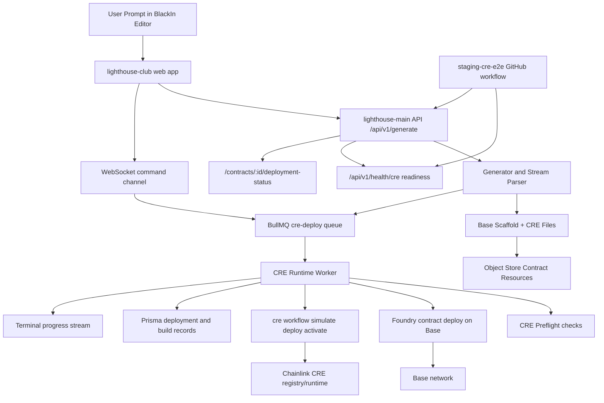

# BlackIn Chainlink CRE Integration Standard

This document is the company standard technical reference for the Chainlink CRE integration used by BlackIn. It explains how BlackIn operates as an AI powered Base-first code editor, how a single prompt travels through generation and deployment, and exactly where Chainlink CRE is implemented in the codebase. The primary external implementation reference is the Chainlink CRE TypeScript and CLI specification at https://docs.chain.link/cre/llms-full-ts.txt, and this document maps that model to BlackIn runtime behavior and source files.

BlackIn is implemented as two coordinated repositories. The backend orchestration runtime lives in `lighthouse-main`, where API ingress, generation, queue orchestration, deployment execution, and operational health checks are implemented. The frontend experience lives in `lighthouse-club`, where prompt submission, streaming UX, terminal commands, wallet providers, and deployment command initiation are implemented. In `lighthouse-main`, process bootstrap, middleware registration, CORS policy wiring, and API route mounting are implemented in `apps/server/src/index.ts:6-45`, while route contracts for generation, deployment status, and CRE readiness are declared in `apps/server/src/routes/index.ts:45-178`. In `lighthouse-club`, generation requests are sent through `apps/web/src/lib/server/generate_contract.ts:24-280`, terminal command handling is implemented in `apps/web/src/hooks/useTerminal.ts:17-90`, and deploy command literals are defined in `apps/web/src/lib/terminal_commands.ts:46-78`.

The runtime contract is Base-only by active behavior. Chain resolution and chain enablement are enforced in `apps/server/src/chains/registry.ts:14-42` and guarded for incoming requests in `apps/server/src/chains/request_guard.ts:11-34`. Command surfaces are aligned to Base deploy commands while retaining explicit Solana-disabled guards in `apps/server/src/schemas/command_schema.ts:9-18`, `packages/types/src/build_types/build_types.ts:18-28`, `apps/socket/src/ws/socket.server.ts:72-116`, and `apps/socket/src/services/services.command.ts:21-89`. On the frontend side, Base deploy commands are exposed through `winter deploy --base-sepolia` and `winter deploy --base-mainnet` in `apps/web/src/lib/terminal_commands.ts:35-37` and forwarded to websocket events in `apps/web/src/hooks/useTerminal.ts:69-77`.

The end-to-end execution path starts with authenticated prompt ingestion in `POST /api/v1/generate`, implemented by `apps/server/src/controllers/gen/generate_contract_controller.ts:15-190`. This controller validates payload shape with `generate_contract` schema in `apps/server/src/schemas/generate_contract_schema.ts:16-22`, resolves chain intent, blocks disabled chain paths, and dispatches generation through `Contract.generate_new_contract` and `generator.generate` in `apps/server/src/class/contract.ts:151-183` and `apps/server/src/generator/generator.ts:73-170`. Planning mode and prompt-to-plan context execution are exposed through `apps/server/src/controllers/chat-controller/plan_executor_controller.ts:15-100`, which also applies the same chain guards.

During generation, the backend composes a CRE-aware plan and builds a Base workspace scaffold. CRE workflow planning metadata is added by `composeCreWorkflow` usage in `apps/server/src/generator/generator.ts:190-196`. Base workspace scaffold generation, including CRE folder and workflow artifacts, is implemented in `prepareBaseMonorepoTemplate` at `apps/server/src/chains/base/template.ts:27-420`. The generated scaffold includes `project.yaml`, `secrets.yaml`, and `cre/base-runtime-workflow` files, and also embeds `@chainlink/cre-sdk` usage in generated workflow code and package dependencies at `apps/server/src/chains/base/template.ts:233-406`. After file creation and finalization, the generator uploads resources and enqueues a CRE deploy job in `apps/server/src/generator/generator.ts:398-409`.

Queue orchestration for CRE deployment is handled in two stages. Queue contract and payload shape are defined in `apps/server/src/queue/cre_worker_queue.ts:9-29`. Service boot creates the CRE deploy queue and worker in `apps/server/src/services/init.ts:39-45`, after running a startup CRE preflight in `apps/server/src/services/init.ts:25-37`. Socket initiated deployments are routed into the same `cre-deploy` queue from `apps/socket/src/services/services.command.ts:129-135` via queue adapters in `apps/socket/src/queue/redis.socket.queue.ts:48-60` and `apps/socket/src/services/services.init.ts:15-21`. This gives both prompt-driven deploys and terminal-driven deploys a single runtime execution path.

The core Chainlink CRE integration is implemented in `apps/server/src/chains/base/cre_adapter.ts:1-1620`. Environment resolution for CLI path, minimum CLI version, runner mode, deployer key, API key, Base RPC URLs, and Ethereum Mainnet funding RPC is implemented in `apps/server/src/chains/base/cre_adapter.ts:167-221`. Workflow project manifest rendering, secrets mapping, workflow YAML generation, workflow package setup, and generated TypeScript CRE workflow source are implemented in `apps/server/src/chains/base/cre_adapter.ts:388-540`. Project materialization and patching into temporary workspaces, including `project.yaml`, `secrets.yaml`, `workflow.yaml`, `main.ts`, and target config files, is handled in `apps/server/src/chains/base/cre_adapter.ts:920-981`.

Preflight readiness logic follows the Chainlink CRE operational model by validating CLI availability, CLI version constraints, authentication, account deploy access, linked key status, and deployer wallet funding. That behavior is implemented in `runCreDeployPreflight` at `apps/server/src/chains/base/cre_adapter.ts:1088-1225`. The startup variant used during service boot is implemented in `runCreStartupPreflight` at `apps/server/src/chains/base/cre_adapter.ts:1227-1236`. Deploy access parsing and linked-key parsing are intentionally separated into deterministic parser modules at `apps/server/src/chains/base/cre_deploy_access_parser.ts:6-37` and `apps/server/src/chains/base/cre_linked_keys_parser.ts:11-57`, with parser coverage in `apps/server/src/chains/base/cre_adapter.deploy_access.test.ts:17-47` and `apps/server/src/chains/base/cre_adapter.linked_keys.test.ts:18-65`.

The deployment executor implements strict ordering of Base contract deployment and CRE workflow lifecycle commands. The deploy runtime is implemented in `executeCreDeployWorkflow` at `apps/server/src/chains/base/cre_adapter.ts:1350-1620`, where Foundry deployment executes first in `apps/server/src/chains/base/cre_adapter.ts:1394-1423`, CRE project files are ensured and patched in `apps/server/src/chains/base/cre_adapter.ts:1424-1435`, and then official CRE lifecycle operations are executed in order with `workflow simulate`, `workflow deploy`, and `workflow activate` in `apps/server/src/chains/base/cre_adapter.ts:1443-1540`. The result serializer captures tx hash, workflow metadata, registry transaction metadata, logs, and step status in `apps/server/src/chains/base/cre_adapter.ts:1562-1616`. This aligns directly with the CLI lifecycle pattern in the Chainlink reference.

Worker-side persistence and user feedback are implemented in `apps/server/src/queue/cre_runtime_worker.ts:25-340`. The worker validates Base chain constraints in `apps/server/src/queue/cre_runtime_worker.ts:70-93`, loads generated resources in `apps/server/src/queue/cre_runtime_worker.ts:159-162`, executes CRE deployment in `apps/server/src/queue/cre_runtime_worker.ts:171-184`, validates non-zero deployed contract addresses in `apps/server/src/queue/cre_runtime_worker.ts:186-196`, updates deployment and build records in `apps/server/src/queue/cre_runtime_worker.ts:199-237`, and emits structured terminal progress and completion or failure notifications in `apps/server/src/queue/cre_runtime_worker.ts:273-337`. Deployment status retrieval for the UI and API clients is served by `apps/server/src/controllers/contract-controller/getDeploymentStatus.ts:16-82` and routed at `apps/server/src/routes/index.ts:163-168`.

Operational readiness and production exposure controls are implemented in dedicated security and health surfaces. CORS policy is generated from explicit origin allowlists in `apps/server/src/security/cors.ts:17-41` and attached in `apps/server/src/index.ts:25-30`. Admin-secret protection for privileged health surfaces is implemented in `apps/server/src/middlewares/middleware.adminSecret.ts:22-41` and combined with auth middleware on health routes in `apps/server/src/routes/index.ts:46-61`. CRE readiness diagnostics, including strict preflight pass/fail behavior and runner mode reporting, are implemented in `apps/server/src/controllers/health-controller/getCreHealthController.ts:60-142`.

Continuous delivery validation for CRE is implemented through staging smoke automation. The workflow `staging-cre-e2e` in `.github/workflows/staging-cre-e2e.yml:1-79` verifies health readiness, executes smoke generation and deployment checks, and uploads artifacts. The smoke runner in `apps/server/src/scripts/cre_e2e_smoke.ts:150-266` performs prompt submission, waits for stream completion, polls deployment status, validates Base deployment outputs, and writes machine-readable artifacts for release evidence.

The frontend aligns to this backend contract by always generating for Base and dispatching Base deploy terminal commands. API generation requests pin `chain: Chain.BASE` in `apps/web/src/lib/server/generate_contract.ts:43-49`, `apps/web/src/lib/server/generate_contract.ts:93-99`, and `apps/web/src/lib/server/generate_contract.ts:254-259`. Command transport emits Base deploy events in `apps/web/src/hooks/useTerminal.ts:69-77`, and command vocabulary is maintained in `apps/web/src/lib/terminal_commands.ts:35-37` and `apps/web/src/lib/terminal_commands.ts:58-59`. Wallet and network provider alignment for Base Sepolia and Base Mainnet is implemented in `apps/web/src/providers/WalletProviders.tsx:48-64`.

Environment contract and required runtime keys are validated by `apps/server/src/configs/config.env.ts:14-108` and `apps/socket/src/configs/config.env.ts:13-23`, with documented sample values in `.env.example:1-54`. The CRE keys that are actively used by code paths include `SERVER_CRE_API_KEY`, `SERVER_CRE_ETH_PRIVATE_KEY` or `SERVER_BASE_DEPLOYER_PRIVATE_KEY`, `SERVER_CRE_CLI_PATH`, `SERVER_CRE_CLI_MIN_VERSION`, `SERVER_CRE_RUNNER_MODE`, `SERVER_CRE_PREBUILT_NODE_MODULES_PATH`, `SERVER_CRE_STARTUP_PRECHECK_REQUIRED`, `SERVER_CRE_MIN_MAINNET_BALANCE_WEI`, `SERVER_CRE_WORKFLOW_OWNER_ADDRESS`, `SERVER_ETHEREUM_MAINNET_RPC_URL`, `SERVER_BASE_SEPOLIA_RPC_URL`, and `SERVER_BASE_MAINNET_RPC_URL`, all consumed in `apps/server/src/chains/base/cre_adapter.ts:167-221` and `apps/server/src/chains/base/cre_adapter.ts:1088-1225`. The legacy variables `SERVER_CRE_USE_REMOTE`, `SERVER_CRE_API_URL`, `SERVER_CRE_GENERATION_ENDPOINT`, `SERVER_CRE_DEPLOY_ENDPOINT`, and `SAN_MARINO_AES_GCM_ENCRYPTION_KEY` are not read by current runtime code and are intentionally excluded from the active environment contract.

The architecture and execution flow across prompt, generation, queue, deploy, and status surfaces are represented below.

BlackIn therefore uses Chainlink CRE as a first-class deployment runtime rather than an auxiliary integration. The prompt pipeline generates CRE-compatible artifacts, the deploy worker enforces preflight and chain-safe execution, and the release workflow validates real staging behavior. The source of truth for CRE behavior remains `apps/server/src/chains/base/cre_adapter.ts`, and this document should be updated whenever command sequencing, preflight requirements, runtime env contract, or queue orchestration changes.
