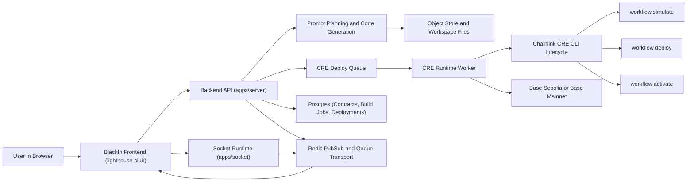

# BlackIn Agentic Smart Contract Auditor

### Project Description

BlackIn is an agentic AI powered code editor built for smart contract development on Base. It brings writing, auditing, and deploying smart contracts into a single browser based environment, designed for developers who want to ship on Base without the overhead of manual tooling and configuration.

### BlackIn 

#### What is it

BlackIn is an agentic AI powered code editor built specifically for smart contracts on Base. It runs entirely in the browser, so there is nothing to install and nothing to configure. Think of it like Cursor, but purpose built for blockchain development with security and deployment built right into the generation process.

#### What problem it solves

Building on Base today requires a developer to know Solidity, set up Foundry, configure Chainlink Runtime Environment manually, write workflow files by hand, and then wire everything together before a single line of contract code is even written. 

That entire setup can take a full day or more, and at every step there is a risk of shipping vulnerable smart contract code that handles real money. Most developers either skip the audit step entirely or do it too late in the process.

BlackIn eliminates both problems at once.

#### How it works

You open BlackIn, describe your project in plain language, and the AI takes over. It plans the application, writes the Solidity smart contracts, generates the frontend, and creates the Chainlink Runtime Environment workflow files, all in one pass. As the contracts are being written, BlackIn audits them against known security vulnerabilities in real time, so the code you see in the editor has already been reviewed before you read it.

Once the code is generated you can refine it through a chat interface, just like Cursor, asking it to add functions, fix logic, or change structure directly. When you are ready, you connect your wallet and deploy to Base Sepolia or Base Mainnet with a single click. The deployment runs through Chainlink Runtime Environment, which handles the full lifecycle including simulate, deploy, and activate, so your workflow is not just deployed but actually live and running on Chainlink's infrastructure.

#### The result

One prompt gives you a complete Base application. Contracts, frontend, Chainlink Runtime Environment workflow, security audit, and a live deployment. What used to take days of setup now takes minutes.

## Project Links

The product walkthrough video is available at https://www.youtube.com/watch?v=UGXNKP0y-ZM. The Chainlink integration reference for this backend is documented at https://github.com/Black-in/lighthouse-main/blob/main/Chainlink.md.

## How to Build and Run the Backend

Install dependencies from the repository root with `pnpm install`, start local infrastructure with `docker compose up -d postgres redis`, synchronize schema with `pnpm db:push`, and then run the backend services with `pnpm --filter server dev` and `pnpm --filter socket dev`. In this setup, the API runs on port `8787` and the socket runtime runs on port `8282`. For validation and build quality, run `pnpm --filter server lint`, `pnpm --filter server run test:cre`, and `pnpm --filter server build`.

## Backend Project Structure

The backend implementation is centered in `apps/server`, where API handlers, generation orchestration, Chainlink runtime integration, and queue workers are implemented. Real time command transport is implemented in `apps/socket`. Persistence and schema logic are maintained in `packages/database`. Base and CRE specific runtime logic is located under `apps/server/src/chains/base`, queue lifecycle execution is defined under `apps/server/src/queue`, and startup service composition is defined in `apps/server/src/services`.

## Project Architecture Diagram

