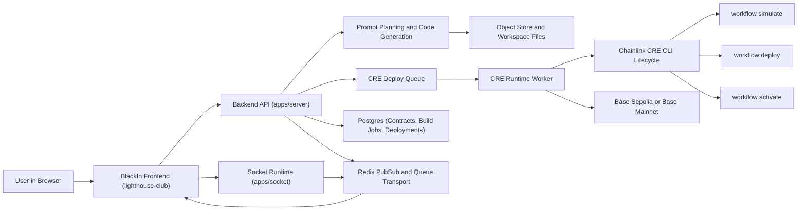

# BlackIn Backend

BlackIn: Agentic Smart Contract Auditor is an agentic AI powered code editor built specifically for smart contracts on Base. It runs in the browser for the product experience, while this backend repository provides the execution engine that turns user intent into generated code, validated workflows, and deployment lifecycle operations. The goal is to remove setup friction and move developers from idea to running Base application without spending a full day wiring Solidity tooling, Foundry, workflow configuration, and deployment orchestration manually.

Building on Base usually requires Solidity knowledge, Foundry setup, manual Chainlink Runtime Environment configuration, hand written workflow files, and many integration steps before the first real feature is delivered. This backend is built to eliminate that sequence. When a prompt arrives, the service plans and generates project artifacts, prepares contract and frontend files, and orchestrates runtime execution through queue workers that can simulate, deploy, and activate workflows while streaming progress back to the product interface.

The Chainlink Runtime Environment path is implemented as a core runtime in this repository. The adapter composes CRE project files, resolves runtime dependencies, prepares WASM plugin prerequisites, performs preflight checks, and executes the workflow lifecycle for simulate, deploy, and activate. The full implementation mapping is documented in Chainlink.md and can be reviewed at https://github.com/Black-in/lighthouse-main/blob/main/Chainlink.md.

The product walkthrough video is available at https://www.youtube.com/watch?v=UGXNKP0y-ZM.

## Project Architecture Diagram

The way BlackIn works is straightforward for the user and rigorous in execution. A user describes a project in natural language, the backend drives generation of Solidity smart contracts and application files, and the system prepares Chainlink Runtime Environment workflow artifacts in the same pass. As iterations continue through chat, this backend keeps state, applies updates, and routes deploy commands to Base Sepolia or Base Mainnet through controlled execution paths so each run has traceable metadata and consistent operational behavior.

To build this project locally, run `pnpm install` in the repository root, start required infrastructure with `docker compose up -d postgres redis`, apply database schema with `pnpm db:push`, and then start backend services with `pnpm --filter server dev` and `pnpm --filter socket dev`. In this setup, the API runs on port `8787` and the socket runtime runs on port `8282`. For validation and release quality, run `pnpm --filter server lint`, `pnpm --filter server run test:cre`, and `pnpm --filter server build`.

The repository structure is organized so execution concerns stay clear and maintainable. The `apps/server` directory contains API handlers, generation orchestration, queue workers, and chain runtime integration. The `apps/socket` directory contains websocket command handling and terminal event transport. The `packages/database` directory contains Prisma schema and persistence contracts, while shared workspace packages provide common types and runtime interfaces used across services. Within the server, Base and CRE runtime logic lives under `apps/server/src/chains/base`, queue orchestration is centered in `apps/server/src/queue`, and startup wiring is defined in `apps/server/src/services`.

The result is that one prompt can produce a complete Base application lifecycle through this backend, including generated contracts, generated application code, Chainlink workflow integration, and deployment execution paths that are ready for simulation and production deployment operations.
