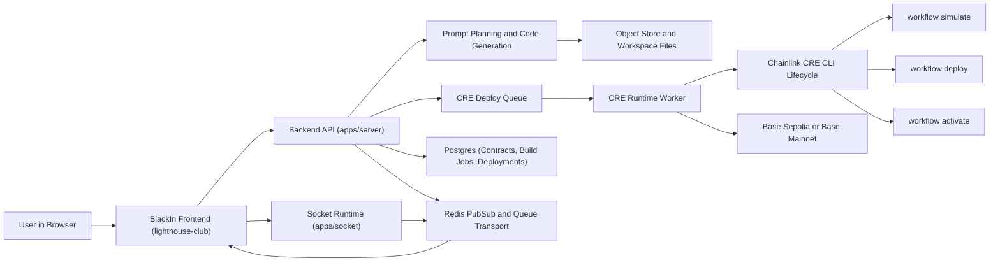

# BlackIn Backend

## Project Description

BlackIn is an agentic AI powered code editor built for smart contract development on Base. It brings writing, auditing, and deploying smart contracts into a single browser based environment, designed for developers who want to ship on Base without the overhead of manual tooling and configuration.

## BlackIn - Agentic Smart Contract Auditor

BlackIn is an agentic AI powered code editor built specifically for smart contracts on Base. It runs entirely in the browser, so there is nothing to install and nothing to configure. It is similar to Cursor in interaction style, but purpose built for blockchain development with security and deployment integrated directly into the generation process.

Building on Base today often requires a developer to understand Solidity deeply, set up Foundry, configure Chainlink Runtime Environment manually, write workflow files by hand, and then wire everything together before a single production meaningful contract line is ready. That setup can consume a full day or more, and each manual step increases the chance of shipping vulnerable code that manages real value. Many teams skip security review early in development or delay it until late in the cycle.

BlackIn eliminates both problems at once. You open BlackIn, describe your project in plain language, and the AI takes over. It plans the application, writes Solidity smart contracts, generates frontend files, and creates Chainlink Runtime Environment workflow files in one pass. While contracts are being written, BlackIn runs audit oriented checks against known vulnerability patterns so developers can review code that is already screened during generation.

After initial generation, the project can be refined through chat in the same workspace by asking for function additions, logic changes, and structural updates. When the project is ready, deployment can be initiated for Base Sepolia or Base Mainnet. The deployment path runs through Chainlink Runtime Environment lifecycle stages including simulate, deploy, and activate so the workflow is not only deployed but brought to an active runtime state.

The final outcome is one prompt producing a complete Base application package with contracts, frontend, Chainlink Runtime Environment workflow, security aware generation, and deployment readiness. Work that previously took days of setup can be reduced to minutes of guided execution.

## Project Links

The product walkthrough video is available at https://www.youtube.com/watch?v=UGXNKP0y-ZM. The Chainlink integration reference for this backend is documented at https://github.com/Black-in/lighthouse-main/blob/main/Chainlink.md.

## How to Build and Run the Backend

Install dependencies from the repository root with `pnpm install`, start local infrastructure with `docker compose up -d postgres redis`, synchronize schema with `pnpm db:push`, and then run the backend services with `pnpm --filter server dev` and `pnpm --filter socket dev`. In this setup, the API runs on port `8787` and the socket runtime runs on port `8282`. For validation and build quality, run `pnpm --filter server lint`, `pnpm --filter server run test:cre`, and `pnpm --filter server build`.

## Backend Project Structure

The backend implementation is centered in `apps/server`, where API handlers, generation orchestration, Chainlink runtime integration, and queue workers are implemented. Real time command transport is implemented in `apps/socket`. Persistence and schema logic are maintained in `packages/database`. Base and CRE specific runtime logic is located under `apps/server/src/chains/base`, queue lifecycle execution is defined under `apps/server/src/queue`, and startup service composition is defined in `apps/server/src/services`.

## Project Architecture Diagram

